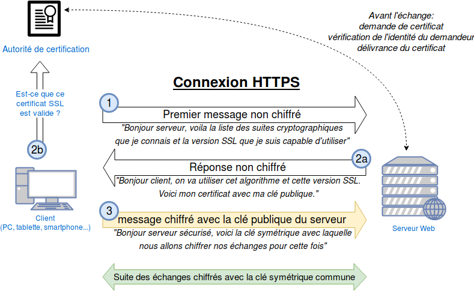

# Chiffrement

## Définition

Le chiffrement permet de rendre la compréhension d'un document impossible à toute personne qui n'a pas la clé de chiffrement. 

Il est notamment utilisé par les protocoles SSH (Secure Shell) et HTTPS (Hypertext Transfer Protocol Secure), utilisés respectivement pour se connecter à une machine à distance et pour accéder à un site web de manière sécurisée.

## Types de chiffrement

### Chiffrement par cryptographie symétrique

Les deux systèmes utilisent la même clé pour chiffrer et déchiffrer les messages qu’ils s’envoient. C’est cette solution qui est utilisée pour les échanges en HTTPS. 

Le problème qui peut se poser est l’échange de cette clé de chiffrement qui peut être interceptée par une attaque “Man in the middle”. 

On utilise les certificats pour permettre cet échange de clé (voir [Certificats et autorités de certification](#certificats-et-autorités-de-certification)).  

#### Exemple HTTPS

### Chiffrement par cryptographie asymétrique

Les deux systèmes utilisent chacun, pour communiquer, deux clés différentes. L'une, la clé publique est utilisée pour chiffrer les messages envoyés, l'autre, la clé privée, pour déchiffrer les messages reçus. 

L'utilisateur qui souhaite recevoir des messages engendre un tel couple de clés. Il ne transmet à personne la clé privée alors que la clé publique est transmissible sans restriction.

Quiconque souhaite lui envoyer un message confidentiel utilise la clé publique pour chiffrer celui-ci. Le message chiffré obtenu ne peut être déchiffré qu'en connaissant la clé privée. 

Il peut donc être communiqué publiquement : la confidentialité du message original est garantie. Le destinataire, qui n'a communiqué à personne sa clé privée, est le seul à pouvoir, à l'aide de celle-ci, déchiffrer le message transmis pour reconstituer le message original.   

#### Exemple SSH

### Autres types de chiffrement

À noter qu’il existe d’autres types de chiffrements mais les deux exemples cités ci-dessus sont les plus rencontrés pour les communications entre systèmes. Il peut être intéressant de connaître également le hachage, utilisé entre autres pour le stockage de mots de passe en base de données. [En savoir plus sur le hachage](https://www.okta.com/fr-fr/identity-101/hashing-algorithms/).

## Certificats et autorités de certification

Les autorités de certification sont des tiers de confiance. Elles vérifient l’identité du propriétaire du site pour lequel elles produisent le certificat. Par exemple, vérifier que banque.fr appartient bien à la banque. 

Une fois cette vérification effectuée, elles délivrent un certificat en le signant avec leur propre clé privée (voir [Chiffrement par cryptographie asymétrique](#chiffrement-par-cryptographie-asymétrique)). 

Ainsi, lorsqu’un utilisateur se connecte sur le site en HTTPS, les navigateurs, qui embarquent les clés publiques de toutes les autorités de certification reconnues, peuvent déterminer si le site est fiable ou non.

On retrouve dans les autorités de certification les plus connus Let’s Encrypt, DigiCert et Sectigo.

## Sources

[Chiffrement](https://fr.wikipedia.org/wiki/Chiffrement)  
[Cryptographie symétrique](https://fr.wikipedia.org/wiki/Cryptographie_sym%C3%A9trique)  
[Cryptographie asymétrique](https://fr.wikipedia.org/wiki/Cryptographie_asym%C3%A9trique)  
