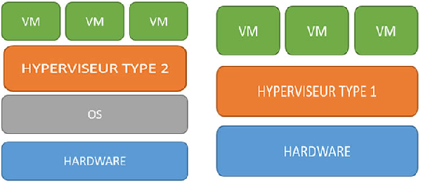

# Virtualisation

## Définitions

### Virtualisation

La *virtualisation* est un processus qui permet à un ordinateur de partager ses ressources matérielles avec plusieurs environnements séparés numériquement. Chaque environnement virtualisé fonctionne dans les limites des ressources qui lui sont allouées, telles que la mémoire, la puissance de traitement et le stockage.

### Machine virtuelle

Une *machine virtuelle* est un ordinateur défini par logiciel qui s'exécute sur un ordinateur physique doté d'un système d'exploitation et de ressources informatiques distincts. L'ordinateur physique est appelé *machine hôte* et les machines virtuelles sont des *machines invitées*. Plusieurs machines virtuelles peuvent être exécutées sur une seule machine physique.

### Hyperviseur

L'*hyperviseur* est un composant logiciel qui gère plusieurs machines virtuelles sur un ordinateur. Il garantit que chaque machine virtuelle reçoit les ressources allouées et n'interfère pas avec le fonctionnement des autres machines virtuelles. Il existe deux types d'hyperviseurs.

#### Hyperviseurs de type 1

Un hyperviseur de type 1, ou hyperviseur de matériel nu, est un programme d'hyperviseur installé directement sur le matériel de l'ordinateur plutôt que sur le système d'exploitation. Par conséquent, les hyperviseurs de type 1 offrent de meilleures performances et sont couramment utilisés par les applications d'entreprise. KVM utilise l'hyperviseur de type 1 pour héberger plusieurs machines virtuelles sur le système d'exploitation Linux.

#### Hyperviseurs de type 2

Également appelé hyperviseur hébergé, l'hyperviseur de type 2 est installé sur un système d'exploitation. Les hyperviseurs de type 2 sont adaptés à l'informatique pour l'utilisateur final.

## Schéma théorique

## Avantages

| Avantages | Exemple concret |
| ----- | ----- |
| **Économie de matériel** | Au lieu d’acheter 10 serveurs physiques, une entreprise peut en utiliser 1 et y faire tourner 10 machines virtuelles. |
| **Isolation et sécurité** | Si une application plante ou est piratée sur une VM, cela n’affecte pas les autres VM ou le serveur physique. |
| **Flexibilité** | Un développeur peut tester une application sur plusieurs versions de Windows ou Linux sans avoir à installer chaque OS sur son PC. |
| **Déploiement rapide** | Créer une nouvelle VM prend quelques minutes, contre plusieurs heures pour installer un serveur physique. |
| **Optimisation des ressources** | On peut allouer exactement la RAM, le CPU et le stockage nécessaires à chaque VM, sans gaspillage. |

## Application pratique

### Développement et test d’applications

* **Problème :** Un développeur doit tester son application sur plusieurs versions de Windows et Linux.  
* **Solution :** Il crée une VM pour chaque version d’OS, teste son application, et supprime les VM une fois les tests terminés.

### Environnements de production et de staging

* **Problème :** Une entreprise veut déployer une nouvelle version de son site web, mais veut d’abord la tester dans un environnement identique à la production.  
* **Solution :** Elle clone la VM de production pour créer une VM de staging, teste la nouvelle version, puis la déploie en production si tout va bien.

### Hébergement web et cloud

* **Problème :** Un hébergeur web veut proposer des serveurs privés virtuels (VPS) à ses clients.  
* **Solution :** Il utilise la virtualisation pour partager un serveur physique entre plusieurs clients, chacun ayant son propre VPS isolé.

### Formation et apprentissage

* **Problème :** Un formateur veut que ses élèves pratiquent l’administration système sans risquer de casser un vrai serveur.  
* **Solution :** Chaque élève reçoit une VM qu’il peut configurer, casser, réinstaller sans conséquence.

## Sources

[Qu'est-ce que la virtualisation ?](https://aws.amazon.com/fr/what-is/virtualization/)

## Aller plus loin  
[Comprendre la virtualisation en 7 minutes](https://www.youtube.com/watch?v=4J_00mQ5BAs)  
[C'est quoi la VIRTUALISATION ?](https://www.youtube.com/watch?v=8ZPy4MovrOM)  
[Le cloud computing expliqué en 7 minutes](https://www.youtube.com/watch?v=RwbIMBSr8o8)